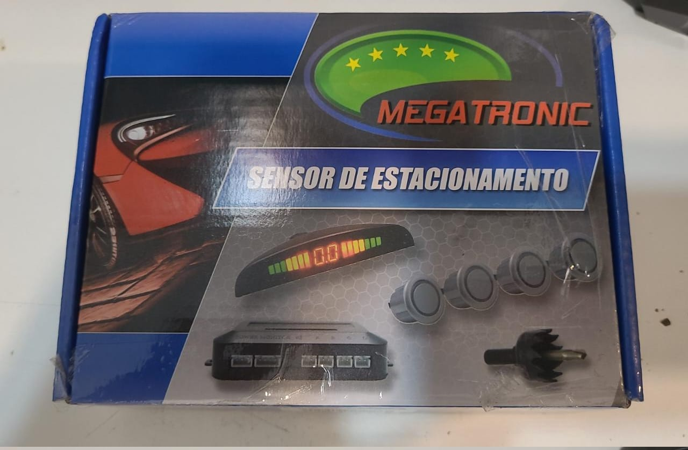
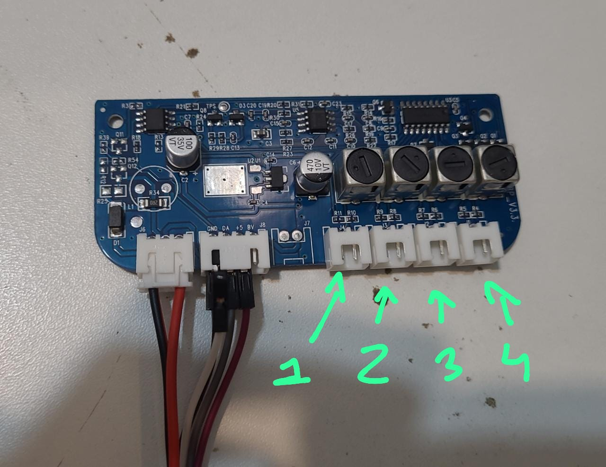
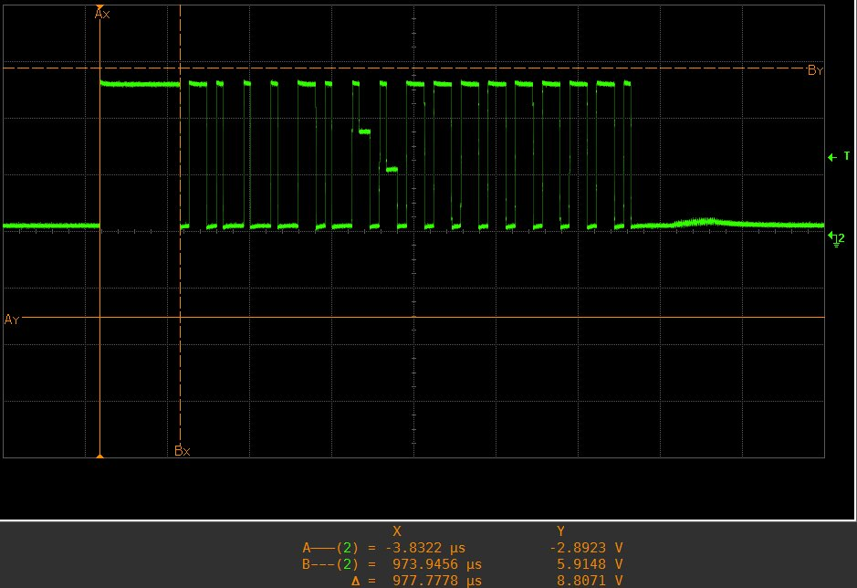

# Arduino Parking Sensor

## Reverse engineering the communication protocol of a low-cost 4-sensor ultrasonic automotive parking sensor for arduino connection.

In development by: Francisval Guedes Soares

## the low cost parking sensor system:

<figure>

<figcaption align = "center"><b>Fig.1 - Sensor sistem</b></figcaption>
</figure>

<figure>

<figcaption align = "center"><b>Fig.2 - PCB</b></figcaption>
</figure>

<figure>

<figcaption align = "center"><b>Fig.3 - Protocol</b></figcaption>
</figure>

